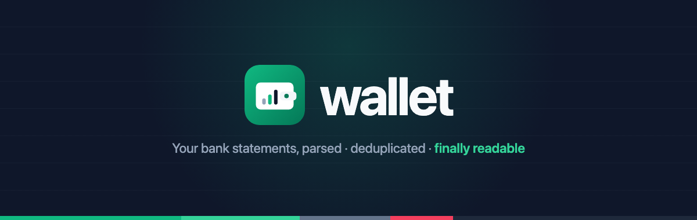
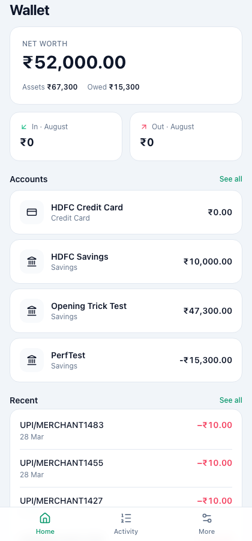
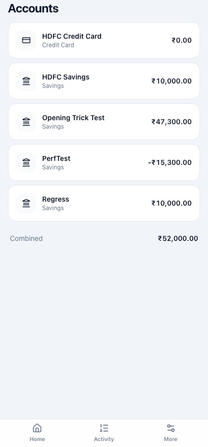
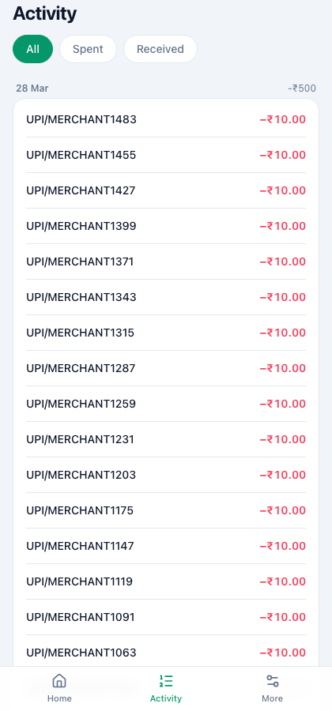
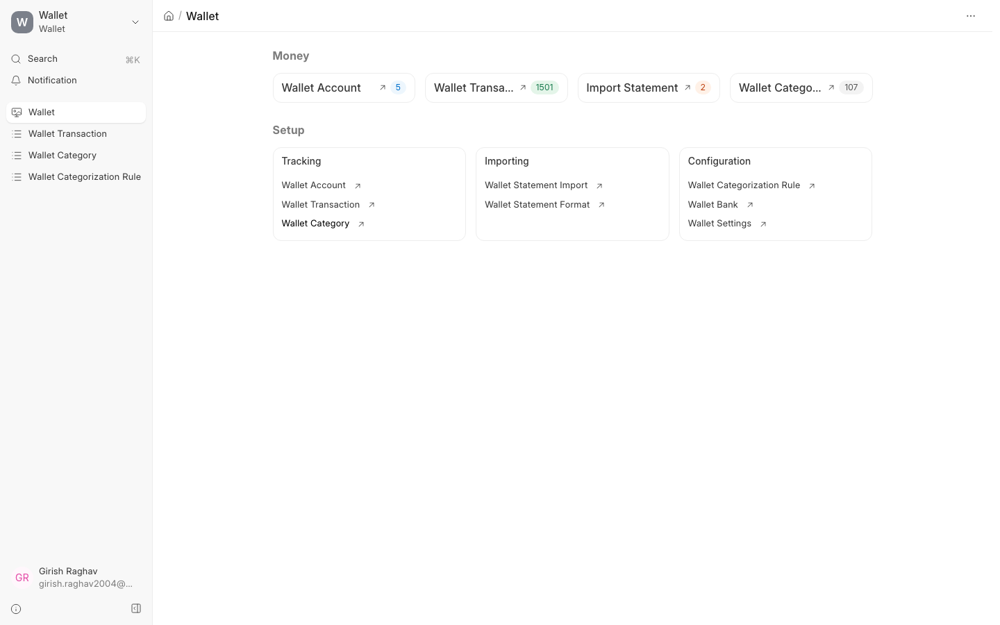
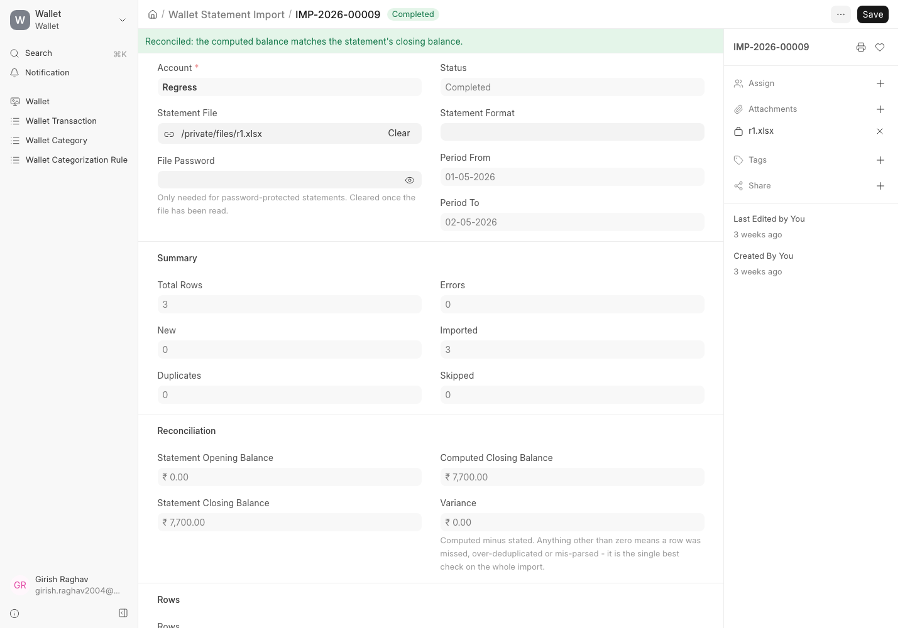
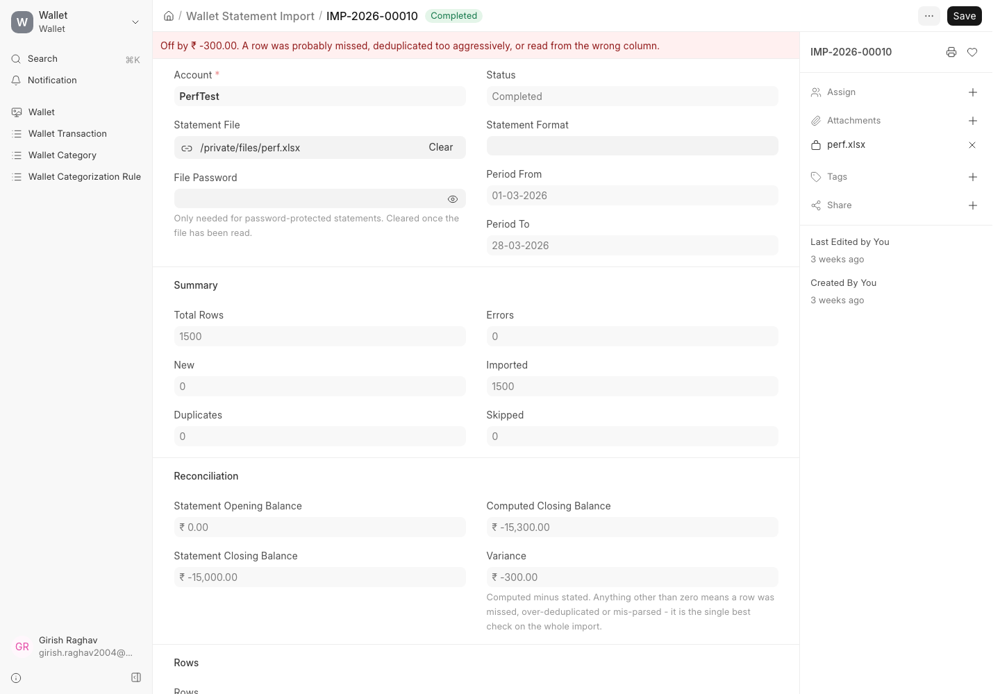

<p align="center">
  
</p>

<p align="center">
  
  
  
  
  
</p>

<p align="center">
  <samp>
    Personal finance for Frappe. Add your bank accounts, drop in the statement files your bank emails you,<br>
    and Wallet parses, de-duplicates and categorizes every row &mdash; then shows you where the money went, on your phone.
  </samp>
</p>

<samp>

> Built for Indian retail banking: `dd/mm` dates, `Dr`/`Cr` suffixes, running-balance columns,
> password-protected xlsx, and out-of-the-box rules for Swiggy, Zomato, UPI, FASTag and NACH EMIs.

</samp>

<br>

# ✨ Features

<table>
  <tr>
    <td width="50%" valign="top"><samp>
      <b>Statement import that survives real bank files</b>
      <br><br>
      Point it at the xlsx your bank emailed you &mdash; encrypted, with three rows of branch details above the table and a totals row below. Wallet finds the transaction table, works out which column is which, and stages every row for review before a single transaction is written.
    </samp></td>
    <td width="50%" valign="top"><samp>
      <b>De-duplication across overlapping statements</b>
      <br><br>
      Statements overlap month to month. Wallet fingerprints each transaction from its own content &mdash; reference number, or date + amount + narration disambiguated by the running balance &mdash; so re-importing an overlapping period is a no-op.
    </samp></td>
  </tr>
  <tr>
    <td width="50%" valign="top"><samp>
      <b>Auto-categorization from your own rules</b>
      <br><br>
      Ships with ~20 rules tuned for Indian bank narrations and a two-level category tree. Rules match on description, counterparty or reference &mdash; by substring, prefix, exact match or regex &mdash; filtered by direction, account and amount range.
    </samp></td>
    <td width="50%" valign="top"><samp>
      <b>Balances that cannot drift</b>
      <br><br>
      A balance is always recomputed as <code>opening_balance + SUM(signed_amount)</code>, never incremented into a stored counter. Multi-currency accounts are totalled per currency and never silently added together.
    </samp></td>
  </tr>
  <tr>
    <td width="50%" valign="top"><samp>
      <b>A reconciliation number you can trust</b>
      <br><br>
      After an import, Wallet compares its computed closing balance against the one the statement itself states. A single number that checks parsing, sign convention and de-duplication all at once.
    </samp></td>
    <td width="50%" valign="top"><samp>
      <b>An MCP server, with writes off by default</b>
      <br><br>
      Ask your AI assistant what you spent on groceries last month, or have it record a cash payment. Five tools, one endpoint, and a write gate that lives inside the tool rather than in the URL.
    </samp></td>
  </tr>
</table>

<br>

# 📱 Preview

<table>
  <tr>
    <td width="33%"></td>
    <td width="33%"></td>
    <td width="33%"></td>
  </tr>
  <tr>
    <td width="33%" align="center" valign="top"><samp>
      <b>Everything in one number</b>
      <br><br>
      Net worth, this month's money in and out, and every account balance &mdash; computed in two queries, not one per account.
    </samp></td>
    <td width="33%" align="center" valign="top"><samp>
      <b>Accounts, and what they really hold</b>
      <br><br>
      Savings, cards, cash and loans together. A spent-on credit card shows as a negative balance, so the combined total is a plain sum.
    </samp></td>
    <td width="33%" align="center" valign="top"><samp>
      <b>Activity that reads like a diary</b>
      <br><br>
      Transactions grouped by day rather than an undifferentiated wall, filterable to just what you spent or just what came in.
    </samp></td>
  </tr>
</table>

<samp>Wallet has two faces. The PWA at <code>/wallet</code> is for looking &mdash; mobile-first, installable, works offline. The Frappe desk at <code>/desk/wallet</code> is for the heavier work: creating accounts, running imports, editing categorization rules.</samp>

<p align="center">
  
</p>

<samp>After an import, the reconciliation block compares Wallet's computed closing balance against the one the statement states.</samp>

<table>
  <tr>
    <td width="50%"></td>
    <td width="50%"></td>
  </tr>
  <tr>
    <td width="50%" align="center" valign="top"><samp>
      <b>✅ Reconciled</b>
      <br><br>
      Variance is zero. Every row parsed, signed and de-duplicated correctly.
    </samp></td>
    <td width="50%" align="center" valign="top"><samp>
      <b>⚠️ Off by ₹300</b>
      <br><br>
      1,500 rows imported and it still says so, instead of letting a mis-parsed row pass quietly.
    </samp></td>
  </tr>
</table>

<br>

# ⚙️ Installation

<table>
<tr>
<td width="50%" valign="top">

<samp>

**📝 Prerequisites**

1. **Frappe Bench** with a **v16** site
2. **Python 3.11+**
3. **Node 18+** and **yarn**
4. **MariaDB** (via bench)
5. `msoffcrypto-tool` — installed by bench from `pyproject.toml`

<br>

**🔮 Optional**

- `frappe-mcp` — only for the MCP server, installed by hand
- `developer_mode` — only for MCP client self-registration

</samp>

</td>
<td width="50%" valign="top">

<samp>

**🪴 Usage**

1. Install the app:

       bench get-app https://github.com/wreckage0907/wallet --branch main
       bench install-app wallet

2. Build the frontend (not committed):

       cd apps/wallet/frontend
       yarn install
       yarn build

3. Assign the **Wallet User** role — install creates it but does not assign it.

4. Open it:

       /wallet        the PWA
       /desk/wallet   the desk workspace

</samp>

</td>
</tr>
</table>

<br>

# 🚀 Getting started

<samp>

| | Step | What happens |
|---|---|---|
| **1** | **Wallet › Wallet Account › New** | Name it, pick a type, set the opening balance and the date it was true as of. Transactions dated before the opening date are rejected rather than silently dropped from the balance. |
| **2** | **Wallet › Import Statement › New** | Pick the account, attach the file, enter the password if your bank encrypts it. |
| **3** | **Parse Statement** | Wallet finds the header row, maps the columns, parses every row and marks each one New, Duplicate or Error. |
| **4** | **Review the preview** | Fix a category, skip a row. Nothing is written yet. If a column was mapped wrong, correct the mapping and re-parse — never hand-edit the values. |
| **5** | **Import N Rows** | Each row commits in its own savepoint, so one bad row cannot take the batch down. Check the variance afterwards. |
| **6** | **Save as Format** *(optional)* | Wallet remembers the layout by its header signature, so the next statement from the same bank skips steps 3 and 4. |

</samp>

<samp>Your categories and rules are seeded per user the first time you use the app. Deleting or renaming one sticks — they are defaults, not fixtures. **More › Restore default categories** brings back anything you deleted and want again, leaving your renames alone.</samp>

<br>

# 🧠 How it works

<details>
<summary><b>📦 Data model</b></summary>
<br>
<samp>

| DocType | What it holds |
|---|---|
| `Wallet Account` | one bank account, card, wallet or loan |
| `Wallet Transaction` | the ledger — one row per transaction |
| `Wallet Category` | a tree of Expense / Income / Transfer categories |
| `Wallet Categorization Rule` | narration pattern → category, with priority |
| `Wallet Statement Import` | one import, with its staged rows as a child table |
| `Wallet Statement Format` | a remembered column layout for a bank's export |
| `Wallet Bank` | shared bank reference data |
| `Wallet Settings` | site-wide defaults, including the MCP write gate |

Account and category names are unique **per user**, not globally — both doctypes are
`autoname: hash` precisely so two people can each have a "HDFC Savings" and a "Groceries".

</samp>
</details>

<details>
<summary><b>🔒 Data isolation</b></summary>
<br>
<samp>

Every personal record is scoped to the user who created it, using the framework's own
`owner` column. There is no `user` Link field — a second copy would just be one more thing
to keep in sync.

Isolation is enforced in three places at once:

1. `if_owner` on the Wallet User role's doctype permissions → form view
2. `permission_query_conditions` → list view, report view, `frappe.get_list`
3. `has_permission` → direct document access

`System Manager` is deliberately **not** exempt. It is an ordinary role that the account
holder themselves almost always has, and exempting it would mean your own list views quietly
mix in other people's transactions. Only `Administrator` is exempt, purely as the
break-glass account for recovery.

</samp>
</details>

<details>
<summary><b>📄 The import pipeline</b></summary>
<br>
<samp>

```
file → decrypt → read grid → detect header → stage rows → review → commit → reconcile
```

**Header detection** scores every row near the top of the file by how many target fields its
cells look like, and takes the best. A row only qualifies if it yields a date column plus at
least one amount column — which is what separates a real header from an address line that
happens to contain the word "Date".

**Footer detection is date-gated.** Summary rows are recognised *after* failing to parse as a
transaction, never before. Checking markers first meant a real fuel payment to "TotalEnergies"
matched a generic "total" marker and was silently dropped.

**dd/mm vs mm/dd is decided per column**, not per cell: any value whose first component
exceeds 12 can only be a day, and that settles it for every other value in the column.

**Staged rows live in a real child table**, not a JSON blob, because the whole point of a
preview is that you can edit it before committing.

</samp>
</details>

<details>
<summary><b>🔁 De-duplication</b></summary>
<br>
<samp>

Three tiers, in order:

1. **Reference number** (UTR, cheque number, transaction id) — already a unique key per account.
2. **Date + signed amount + normalised narration, disambiguated by the running balance.**
   Two genuinely distinct ₹50 payments to the same merchant on the same day would otherwise
   collide; their running balances differ, which separates them for free with no dependence
   on row order and no sensitivity to re-imports or deletions.
3. **An occurrence ordinal**, when the bank supplies neither. The weakest tier: delete one of
   a duplicate pair and re-import, and the ordinal no longer lines up.

Fingerprints are stamped once, on insert, and never recomputed — so correcting a transaction
later never changes which statement row it came from.

Because the fingerprint lives on `Wallet Transaction` rather than on the import, it also
catches a **manual entry that duplicates an imported row**, and survives deleting the import.

</samp>
</details>

<br>

# 🤖 MCP server

<samp>

Wallet can act as an [MCP](https://modelcontextprotocol.io) server, so an AI agent can read
your accounts and transactions and record new ones.

```
/api/method/wallet.mcp.handle_mcp
```

| Tool | | |
|---|---|---|
| `list_accounts` | balances, including what is owed on a credit card | 🔍 read |
| `list_transactions` | filter by account, date, category, direction, or free text | 🔍 read |
| `list_categories` | the names the other tools accept | 🔍 read |
| `get_spending_summary` | money in, money out and spend per category over a period | 🔍 read |
| `add_transaction` | record one transaction | ✍️ write |

One endpoint, not one per access level. **Writes are off by default** and enabled with
`Allow MCP Writes` in Wallet Settings — checked inside the tool body, so it holds however
the endpoint is reached.

Point your MCP client at the endpoint URL; it registers itself, opens your normal Frappe
login, and receives a token once you approve. There is no API key to copy.

```bash
claude mcp add --transport http wallet \
	https://<your-site>/api/method/wallet.mcp.handle_mcp
```

</samp>

<details>
<summary><b>⚙️ Setup</b></summary>
<br>
<samp>

`frappe-mcp` is not in `pyproject.toml`: it pins `Werkzeug==3.1.3` and `pydantic~=2.11.7`
against Frappe's newer pins, so a normal resolve would downgrade Werkzeug and break the
bench. Install it without its dependencies instead:

```bash
./env/bin/pip install jsonschema
./env/bin/pip install --no-deps \
	git+https://github.com/frappe/mcp.git@11d5076b1bf4483b2ff6751a13e0736f5396b1e6
bench restart
```

The commit is pinned deliberately — the library ships breaking changes without notice.

Requires Frappe v16 or later, for the OAuth2 metadata endpoints. Nothing else needs
configuring: `OAuth Settings` enables dynamic client registration and the `.well-known`
metadata endpoints by default.

Verify by listing the tools, as a user with the `Wallet User` or `System Manager` role:

```bash
curl -s -X POST -H "Authorization: token <api_key>:<api_secret>" \
	-H "Content-Type: application/json" \
	-d '{"jsonrpc":"2.0","id":1,"method":"tools/list","params":{}}' \
	https://<your-site>/api/method/wallet.mcp.handle_mcp
```

`frappe-mcp check` reports this handler as "not properly registered". That is expected — it
looks for the `@mcp.register()` decorator, which this app deliberately does not use. See
`wallet/mcp/__init__.py`.

</samp>
</details>

<br>

<hr>

<p align="center">
  <samp>
    Working notes, open findings and security boundaries live in <a href="specs/"><code>specs/</code></a>.
    <br><br>
    MIT &middot; built on <a href="https://frappeframework.com">Frappe</a>
  </samp>
</p>
